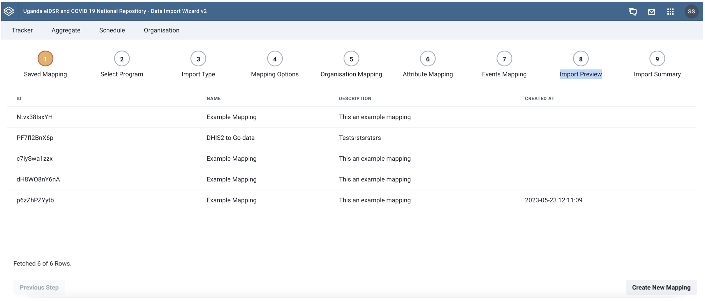
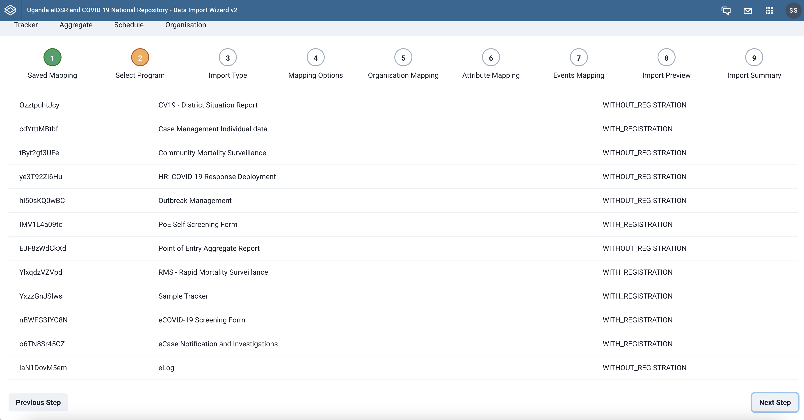
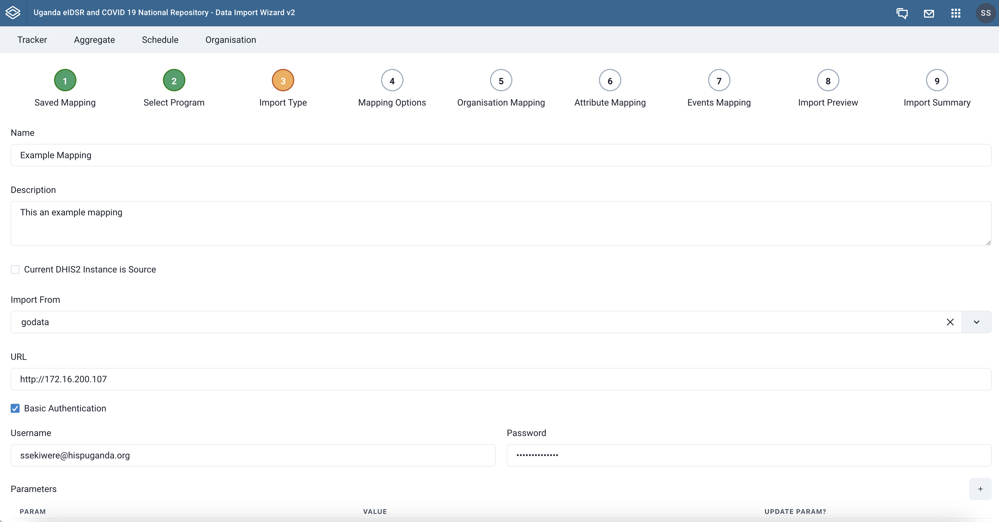
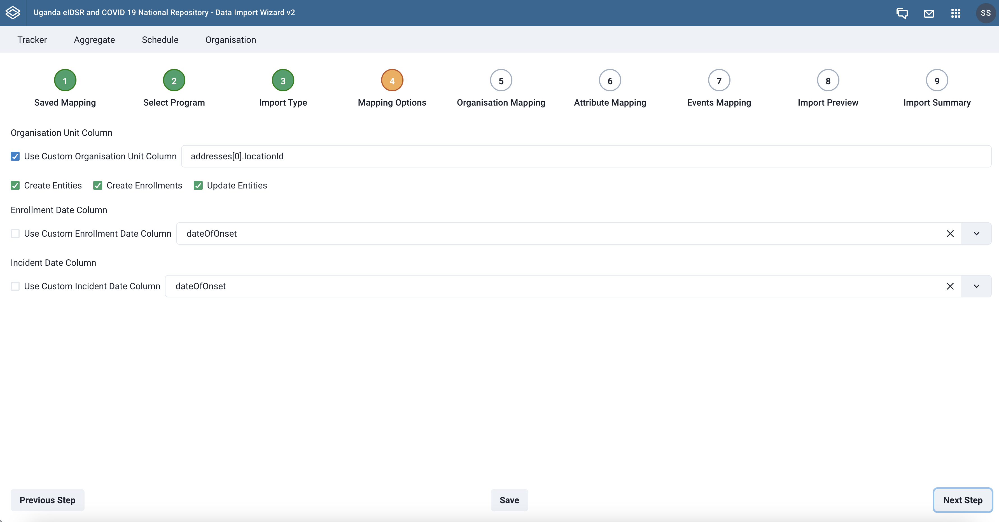
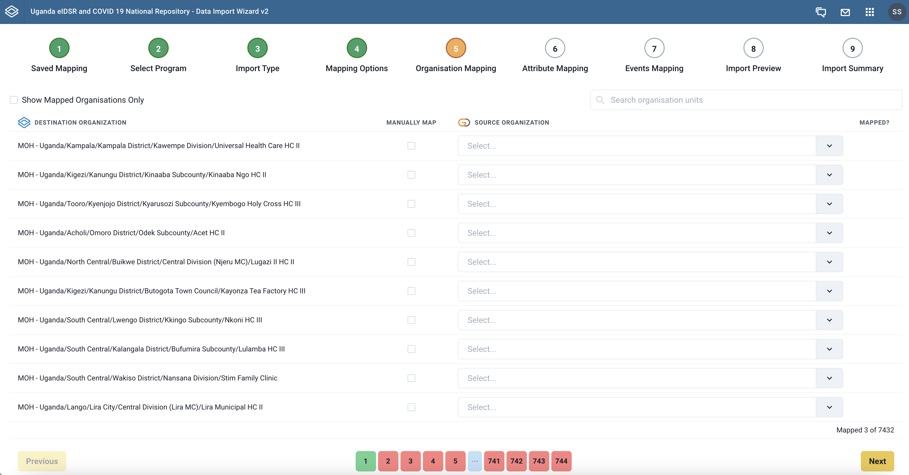
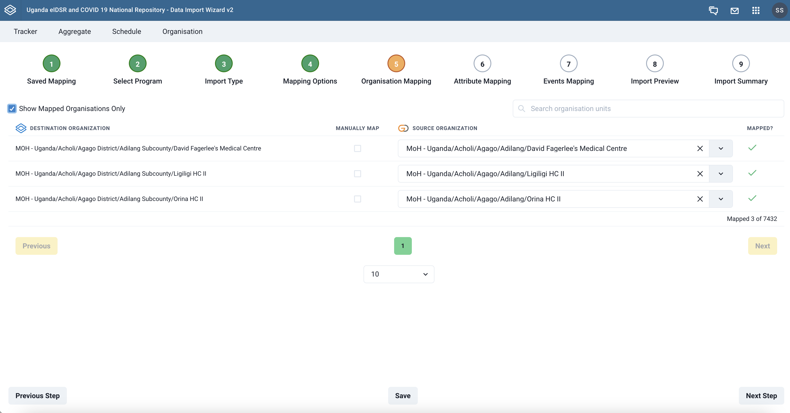
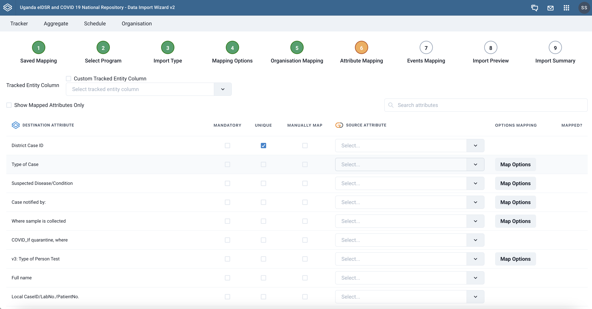
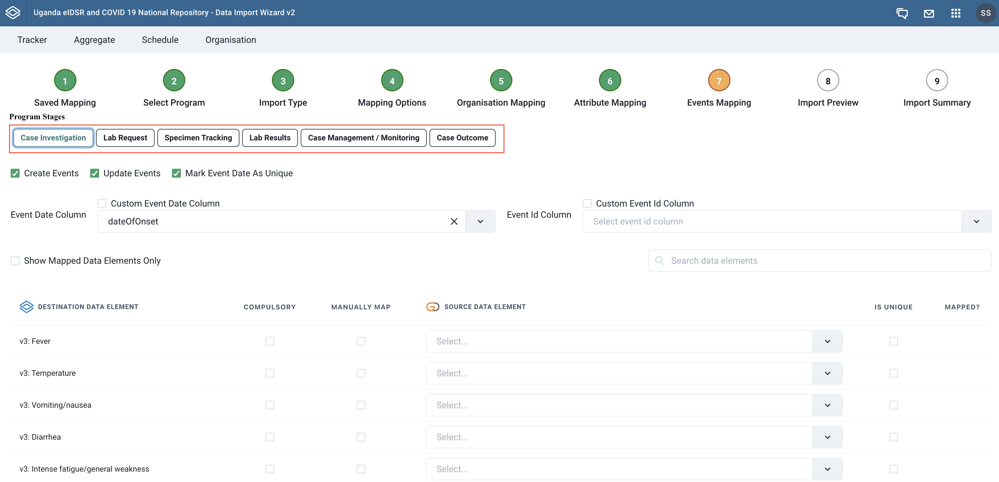

## Tracker
The `Tracker` page walks you through steps that help you to import data from a source (Excel, CSV, JSON, API or Go.Data) to a DHIS2 program events data. We can also use the same page to configure importing from a DHIS2 program's events data to GoDATA.

The steps involved in the mapping and import process depend on whether DHIS2 is the source or destination system.

### When DHIS2 is the destination system

### Tabset {.tabset}

#### Saved Mappings <i class="mdi mdi-numeric-1-circle-outline"></i>

> **Step 1**  - Use existing mapping or create a new one
{.is-success}

This step lists the previously created mappings that you can choose from to start the data import. You can also create a new mapping by clicking the `Create New Mapping` button at the bottom right corner of the page.

|{.decor-shadow .radius-5 .elevation-3}|
|:--:|
| **Saved mapping step** |

#### Select Program <i class="mdi mdi-numeric-2-circle-outline"></i>

>**Step 2** - Select DHIS2 program to map metadata
{.is-success}

Once you choose to create a new mapping, you then have to select a DHIS2 events program whose related metadata you want to map with. In this step, a list of available DHIS2 programs is provided. Select the desired program to proceed to the next step.

|{.decor-shadow .radius-5 .elevation-3}|
|:--:|
| DHIS2 tracker program listing|

#### Import Type <i class="mdi mdi-numeric-3-circle-outline"></i>
> **Step 3** - Specify import sorce and related configurations
{.is-success}

Once a program has been selected, you provide details for where you intend to import data from. in this step, we specify the `name`, `description` of the mapping, `import source` (Go.Data, Excel, CSV, JSON or API), `source authentication credentials`, and the `active outbreak` if the source is Go.DATA. Click the `Save` button at the bottom center of the page to save the provided details.

|{.decor-shadow .radius-5 .elevation-3}|
|:--:|
| **Import source configuration** |

---

For the Go.DATA import type, the outbreak can be selected by clicking the `Select Outbreak` button at the bottom left corner of the page. This uses the credentials provided to fetch the list of outbreaks from Go.DATA and displays it in a modal for you to select one. Once you select an outbreak, you will transition to the next step.

|{.decor-shadow .radius-5 .elevation-3}|
|:--:|
| **Selecting Go.DATA outbreak** |

**Prefetching Data**

#### Mapping Options <i class="mdi mdi-numeric-4-circle-outline"></i>
> **Step 4** - Set some mapping options
{.is-success}

In this step we set some mapping options that are critical to how the data import is made from the current mapping.

1. `Organisation unit Column` - select an organisation unit colum or specify a custom `JSON path` to where it can be picked
2. `Create Entities` - specifies if we are to create tracked entities
3. `Create Enrollments` - specifies whether to create enrollments upon import
4. `Update Entities` - specifies whether we shall update events as we import 
5. `Enrollment Date Column` - specify which field or column holds the enrollment date in the source data.
6. `Incident Date Column` - specify which field or column holds the encident date in the source data.

|{.decor-shadow .radius-5 .elevation-3}|
|:--:|
| Set mapping options |

#### Organisation Mapping <i class="mdi mdi-numeric-5-circle-outline"></i>
> **Step 5** - Mapping locations with DHIS2 Organisation Units
{.is-success}

This step shows the list of organisation units in DHIS2 and makes a provision for a select field that is used for mapping each organisation unit to a source location or organisation unit. 

There is also a provision for a free-form search field that can be used to search through DHIS2 organisation units so that you can quickly map a specific one.

|{.decor-shadow .radius-5 .elevation-3}|
|:--:|
| **List of organisation units to map** |

After mapping locations, you can check the `Show Mapped Organisations Only` checkbox to display the ones mapped so far. Remeber to hit the `Save` button to persist your current mapping. 

|{.decor-shadow .radius-5 .elevation-3}|
|:--:|
| **Listing of mapped organisation units** |

If the source location ids match the DHIS organisation unit ids, the import wizard will auto map for you the organisation units. 

#### Attribute Mapping <i class="mdi mdi-numeric-6-circle-outline"></i>

> **Step 6** - Map tracked entity attributes
{.is-success}

In this step we match the tracked entity attributes for the DHIS 2 program with attributes from the source. Typically, a list of attributes in DHIS2 is displayed in a table where a select field is provided to aid the matching.

First, you choose the `Tracked Entity Column` in your source data from the dropdown provided or you check the `Custom Tracked Entity Column` checkbox to specify a custom expression used to access it in your source data.

The attributes listed in the table can be marked as either `mandatory` or `unique` by ticking the corresponding checkboxes in the table row.

When mapping an attribute, it is also possible to create a custom `JSON Path` like mapping by ticking the checkbox in the `Map Manually` column. This is especially useful if the value of the attribute being mapped is deeply nested within the JSON object of data for Go.DATA or JSON sources.

There is also a provision for a free-form search field that can be used to search through DHIS2 program attributes so that you can quickly map a specific one.

|{.decor-shadow .radius-5 .elevation-3}|
|:--:|
| Mapping program attributes |

##### Options Mapping
Some

#### Events Mapping <i class="mdi mdi-numeric-7-circle-outline"></i>

> **Step 7** - Map data elements in the available program stages
{.is-success}

This step focusses on mapping data elements tracked in the different program stages of the DHIS2 event or tracker program to those data elements in the import source. 

In addition to the data element mapping, we set some configuration on how the data is imported in the respective program stages. The available configuration options include:

1. `Create Events` - specifies whether to create events in current stage upon data import
2. `Update Events` - specifies whether to update to update events when importing data
3. `Mark Event Date As Unique` - When set, this option ensures that the event date is unique for the tracked entities in the specif program stage.
4. `Event Date Column` - specifies what the event date maps to in the import source.
5. `Event Id Column` - specifies what the event ID maps to in the import source. The IDs hould be valid DHIS2 UIDs.

Click on one of the program stages (marked in <kbd style="color: red; background: lavender;">red</kbd> in graphic below), right below the steps to see the mapping configurations and the data elements to map for the stage.

|{.decor-shadow .radius-5 .elevation-3}|
|:--:|
| **Event Mapping** |

Remember to click the <kbd style="color: black; background: #ddd;">Save</kbd> button at the bottom center of the page to save the recorded mapping.

> :warning: Important!
>At this point, a saved mapping can be used to schedule data import from Go.DATA to DHIS2 even if you do not proceed to the next steps of <kbd style="color: black; background: #ddd;">Import Preview <i class="mdi mdi-numeric-8-circle-outline"></i></kbd> and <kbd style="color: black; background: #ddd;">Import Summary <i class="mdi mdi-numeric-9-circle-outline"></i></kbd> 
>
> However, if you are importing from Excel, CSV or JSON as a source, you will have to proceed to the next steps.
{.is-warning}

#### Import Preview <i class="mdi mdi-numeric-8-circle-outline"></i>

> **Step 8** - Preview for the data to be imported
{.is-success}

Once the mapping is complete, the application provides a preview for the data to be imported into the DHIS2 tracker or event program.

#### Import Summary <i class="mdi mdi-numeric-9-circle-outline"></i>

> **Step 9** - The data import summary
{.is-success}

### When Go.DATA is the destination system

The steps involved in the proccess of importing data from DHIS2 to Go.DATA are slightly fewer than when doing the reverse import. In this section, we describe the process of importing data from a DHIS2 tracker or event program to Go.DATA.

### Tabset {.tabset}

#### Saved Mappings <i class="mdi mdi-numeric-1-circle-outline"></i>

> **Step 1**  - Use existing mapping or create a new one
{.is-success}

This step lists the previously created mappings that you can choose from to start the data import. You can also create a new mapping by clicking the `Create New Mapping` button at the bottom right corner of the page.

|{.decor-shadow .radius-5 .elevation-3}|
|:--:|
| **Saved mapping step** |

#### Select Program <i class="mdi mdi-numeric-2-circle-outline"></i>

>**Step 2** - Select DHIS2 program to map metadata
{.is-success}

Once you choose to create a new mapping, you then have to select a DHIS2 events program whose related metadata you want to map with. In this step, a list of available DHIS2 programs is provided. Select the desired program to proceed to the next step.

|{.decor-shadow .radius-5 .elevation-3}|
|:--:|
| **DHIS2 tracker program listing** |

#### Import Type <i class="mdi mdi-numeric-3-circle-outline"></i>
> **Step 3** - Specify import sorce and related configurations
{.is-success}

Once a program has been selected, you provide details for where you intend to import data from. in this step, we specify the `name`, `description` of the mapping, `import source` (Go.Data, Excel, CSV, JSON or API), `source authentication credentials`, and the `active outbreak` if the source is Go.DATA. Click the `Save` button at the bottom center of the page to save the provided details.

|{.decor-shadow .radius-5 .elevation-3}|
|:--:|
| **Import source configuration** |

---

For the Go.DATA import type, the outbreak can be selected by clicking the `Select Outbreak` button at the bottom left corner of the page. This uses the credentials provided to fetch the list of outbreaks from Go.DATA and displays it in a modal for you to select one. Once you select an outbreak, you will transition to the next step.

|{.decor-shadow .radius-5 .elevation-3}|
|:--:|
| **Selecting Go.DATA outbreak** |

**Prefetching Data**

#### Organisation Mapping <i class="mdi mdi-numeric-4-circle-outline"></i>
> **Step 5** - Mapping locations with DHIS2 Organisation Units
{.is-success}

This step shows the list of organisation units in DHIS2 and makes a provision for a select field that is used for mapping each organisation unit to a source location or organisation unit. 

There is also a provision for a free-form search field that can be used to search through DHIS2 organisation units so that you can quickly map a specific one.

|{.decor-shadow .radius-5 .elevation-3}|
|:--:|
| List of organisation units to map |

After mapping locations, you can check the `Show Mapped Organisations Only` checkbox to display the ones mapped so far. Remeber to hit the `Save` button to persist your current mapping. 

|{.decor-shadow .radius-5 .elevation-3}|
|:--:|
| **Listing of mapped organisation units** |

If the source location ids match the DHIS organisation unit ids, the import wizard will auto map for you the organisation units. 

#### System Mapping <i class="mdi mdi-numeric-5-circle-outline"></i>
> **Step 4** - Set some mapping options
{.is-success}

In this step we set some mapping options that are critical to how the data import is made from the current mapping.

1. `Organisation unit Column` - select an organisation unit colum or specify a custom `JSON path` to where it can be picked
2. `Create Entities` - specifies if we are to create tracked entities
3. `Create Enrollments` - specifies whether to create enrollments upon import
4. `Update Entities` - specifies whether we shall update events as we import 
5. `Enrollment Date Column` - specify which field or column holds the enrollment date in the source data.
6. `Incident Date Column` - specify which field or column holds the encident date in the source data.

|{.decor-shadow .radius-5 .elevation-3}|
|:--:|
| **Set mapping options** |

#### Import Summary <i class="mdi mdi-numeric-6-circle-outline"></i>

> **Step 6** - Map tracked entity attributes
{.is-success}

In this step we match the tracked entity attributes for the DHIS 2 program with attributes from the source. Typically, a list of attributes in DHIS2 is displayed in a table where a select field is provided to aid the matching. 

Some attributes can be marked as either `mandatory` or `unique` by ticking the corresponding checkboxes in the table row.

When mapping an attribute, it is also possible to create a custom `JSON Path` like mapping by ticking the checkbox in the `Map Manually` column. This is especially useful if the value of the attribute being mapped is deeply nested within the JSON object of data for Go.DATA or JSON sources.

There is also a provision for a free-form search field that can be used to search through DHIS2 program attributes so that you can quickly map a specific one.

|{.decor-shadow .radius-5 .elevation-3}|
|:--:|
| **Mapping program attributes** |

